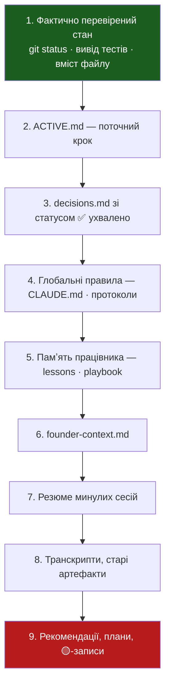
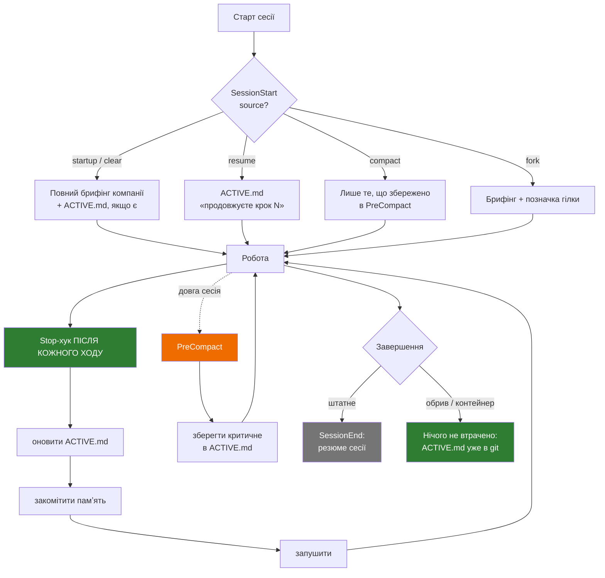
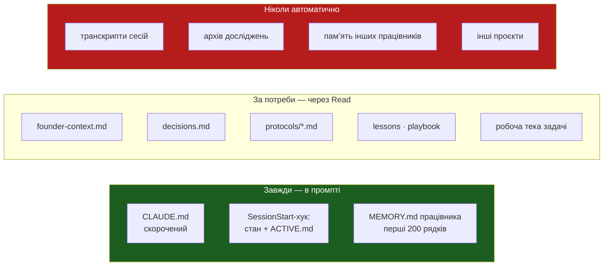

# Аудит Hermes — частина II: життєвий цикл сесій і безперервність контексту

**Дата:** 2026-08-01
**Предмет:** доповнення до документа гіпотез (session lifecycle, lineage, startup/close)
**Основа:** `report.md` (частина I)
**Змін у системі не внесено.**

---

## Головний висновок частини II

**Діагноз у доповненні правильний. Запропоноване лікування — переважно ні.**

Доповнення знаходить справжню прогалину: у вас є механізм **входу** в сесію
(`SessionStart`-хук) і немає механізму **виходу**. Сесія закінчується — і те, на чому
вона зупинилась, зникає разом із контейнером. Це реально і це треба закрити.

Але запропонована реалізація (три бази SQLite, 13-польова модель lineage, реєстр сесій,
context router, переїзд у `.company/`) переносить рішення з **іншої платформи**, де
Hermes будувався. У Claude Code половина цього вже є нативно, а SQLite тут — крок назад.

**І найважливіше — доповнення робить архітектурну помилку, яку треба назвати прямо:**

> Воно проєктує «закриття сесії» як **фінальну операцію**. У вашому середовищі контейнер
> **ефемерний і забирається без попередження**. Сесія, яка впала, не виконає ніякого
> протоколу закриття. Отже, точка продовження мусить писатися **інкрементально по ходу
> роботи**, а не в кінці.

Це інвертує весь дизайн розділу 6 доповнення. Деталі — C7.

---

## Перевірені факти про Claude Code (нові для цієї частини)

| Механізм | Статус | Наслідок для гіпотези |
|---|---|---|
| `SessionEnd`-хук | **Існує.** Матчери: `clear`, `resume`, `logout`, `prompt_input_exit`, `other`. **Не може блокувати** | Протокол закриття можливий, але ненадійний — див. C7 |
| `SessionStart` має поле `source` | **Існує:** `startup` · `resume` · `clear` · `compact` · `fork` | Ваш хук його **ігнорує** — критично, див. C8 |
| `PreCompact` / `PostCompact` | **Існують.** `PreCompact` **може блокувати** компакцію | Справжнє місце втрати контексту. Хука немає — див. C9 |
| `SubagentStart`-хук | Існує, вміє `additionalContext` | Механічна доставка контракту працівнику |
| `transcript_path` у кожному хуку | Існує | «Raw Session Store» будувати не треба |
| `session_id` у кожному хуку | Існує | Ідентифікатори сесій вести не треба |
| `--resume` / `--continue` / `/fork` | Існують нативно | Реєстр lineage дублює платформу |
| `additionalContext` у `SessionStart` | Вставляється **на початку розмови, до першого промпту** | Точний механізм для startup-пакета |

**Висновок із таблиці:** із чотирьох механізмів, які доповнення називає обовʼязковими
(startup context · active state · session lineage · session close), **один уже
реалізований**, **один існує нативно і не потребує побудови**, і **два справді
відсутні**.

| Механізм доповнення | Стан |
|---|---|
| 1. Startup context | ✅ є (`session-brief.sh`), потребує двох виправлень |
| 2. Active state | ❌ **немає** — справжня прогалина |
| 3. Session lineage | 🟡 є нативно (`session_id`, транскрипти, `--resume`); власний реєстр — дублювання |
| 4. Session close | ❌ **немає** — справжня прогалина, але не як «закриття» |

---

## C7. Протокол закриття, який не спрацює тоді, коли потрібен

**Проблема.** Доповнення проєктує `session_close` як процедуру в кінці сесії: перевірити
результат, оновити статус, створити резюме, сформувати `resume_instructions`.

Це працює, коли сесія завершується **штатно**. Але прогалина, яку доповнення закриває,
виникає саме при **нештатному** завершенні: обрив звʼязку, вичерпаний контекст, забраний
контейнер, закритий ноутбук.

`SessionEnd` не спрацює, коли контейнер забрано. `SessionEnd` **не може блокувати** —
тобто навіть якщо спрацює, він не має права затримати завершення, щоб дописати стан.

**Наслідок.** Протокол закриття покриє рівно ті випадки, де він найменш потрібен, і
не покриє жодного, де він критичний.

**Імовірність:** висока
**Критичність:** висока (це підриває всю мету доповнення)

**Рішення — інвертувати дизайн.**

Точка продовження пишеться **по ходу роботи**, а не в кінці. У вас уже є доведений
зразок такої логіки: `Stop`-хук комітить памʼять **після кожного ходу**, а не в кінці
сесії. Саме тому памʼять переживає обрив.

Застосувати той самий принцип до стану:

```
Stop-хук (після кожного ходу):
  1. оновити company/workspace/ACTIVE.md   ← точка продовження
  2. закомітити памʼять                    ← уже є
  3. запушити                              ← уже є
```

Тоді після будь-якого обриву — штатного чи ні — у git лежить актуальна точка входу.
`SessionEnd` лишається **необовʼязковою прикрасою**: якщо спрацював, дописав акуратне
резюме; не спрацював — нічого не втрачено.

Це дешевше за запропоноване (немає окремої процедури закриття, немає реєстру сесій) і
надійніше за визначенням.

---

## C8. `SessionStart`-хук ігнорує поле `source`

**Проблема (перевірено на коді).** `session-brief.sh` не читає stdin взагалі. Він друкує
один і той самий брифінг компанії на **всі** події `SessionStart`: `startup`, `resume`,
`clear`, `compact`, `fork`.

Наслідки конкретні:

| Подія | Що треба | Що відбувається |
|---|---|---|
| `startup` | повний брифінг | ✅ правильно |
| `resume` | «ви продовжуєте роботу, ось на чому спинились» | ❌ повний брифінг, ніби нова сесія |
| `compact` | нагадати те, що щойно втрачено при стисненні | ❌ повний брифінг компанії — не те, що втрачено |
| `clear` | брифінг | 🟡 прийнятно |
| `fork` | позначити, що це гілка | ❌ не розрізняється |

**Це рівно та помилка, яку доповнення описує як провал сесії:** «нова сесія починає
з чистого аркуша» і «завантаження широкого нерелевантного контексту».

**Імовірність:** 100% (відбувається зараз)
**Критичність:** середня-висока

**Рішення.** Читати `source` зі stdin (хук уже отримує JSON — `worker-memory-check.sh`
у цьому ж репозиторії вже вміє це робити, код можна взяти звідти) і розгалужити вивід.
При `resume` і `compact` — не повторювати брифінг компанії, а показати `ACTIVE.md`.

Обсяг: ~15 рядків bash у наявному файлі.

---

## C9. Контекст втрачається на компакції, а не на завершенні сесії

**Проблема.** Доповнення зосереджене на межі між сесіями. Але в довгій сесії контекст
губиться **всередині** неї — при автоматичному стисненні. Модель не «завершує сесію»,
вона тихо втрачає середину розмови й продовжує працювати, вважаючи, що все знає.

Це небезпечніше за обрив: після обриву ви бачите, що сесія нова. Після компакції нічого
не змінюється зовні.

`PreCompact` і `PostCompact` існують. `PreCompact` **може заблокувати** стиснення.
Хуків немає.

**Імовірність:** висока (довгі сесії з ланцюгами працівників — типовий сценарій)
**Критичність:** висока

**Рішення.** `PreCompact`-хук, який перед стисненням дописує в `ACTIVE.md` те, що не
можна втрачати: поточний крок, зроблене незворотне, відкриті питання. Після компакції
`SessionStart(source=compact)` вливає це назад.

Це закриває питання доповнення «як не втратити незавершену роботу» в тому місці, де
вона реально втрачається.

---

## C10. Ієрархія джерел правди — найцінніше в обох документах

**Це не проблема, а прогалина, і її треба закрити дослівно.**

Доповнення дає набір правил, яких у вас **немає ніде**, і які коштують нуль рядків коду:

> - памʼять не може автоматично перемогти перевірений стан;
> - рекомендація не є рішенням;
> - запланована робота не є виконаною;
> - старий статус не можна використовувати без перевірки дати;
> - історичний документ не є runtime-інструкцією;
> - конфлікт не можна мовчки приховувати.

**Чому це критично саме у вас.** `company/ledger/decisions.md` — 19 КБ. У ньому лежать
і ухвалені рішення, і, за форматом протоколу, альтернативи та рекомендації. Нова сесія
читає файл і не має жодного формального способу відрізнити «так вирішили» від
«так пропонували».

Помножте на C2 із частини I (працівник сам підтверджує власну роботу) — і ви отримуєте
шлях, яким **пропозиція стає фактом за дві сесії**:

```
працівник рекомендує  →  записано в decisions.md  →  наступна сесія читає як рішення
                                                   →  діє на його основі
                                                   →  записує наслідок як перевірений факт
```

**Рішення.** Один файл `company/protocols/source-of-truth.md` + позначка статусу в
кожному записі `decisions.md`:

```
Статус: ✅ ухвалено засновником | 🟡 рекомендація | ⬜ розглядається | ❌ відхилено
Дата: 2026-08-01
Ким ухвалено: засновник / оркестратор / працівник <slug>
```

Порядок авторитетності (адаптований під ваше середовище):



**Одне заперечення до доповнення.** Воно ставить «глобальні правила» на 5-те місце,
нижче за рішення й задачі. Це помилка для вашої системи: `escalation.md` (не витрачати
гроші, не публікувати без дозволу) **не може** поступатися активній задачі — інакше
задача «опублікуй лендінг» переможе правило «публікація потребує підтвердження».

**Правила безпеки й ескалації стоять поза ієрархією. Вони не програють нічому.**

---

## Схеми

### Життєвий цикл сесії (рекомендований)



Зелене — те, що гарантує безперервність. Сіре (`SessionEnd`) — приємно, але
на нього не покладаємось.

### Завантаження контексту



**Це вже майже так працює.** Головне порушення — `CLAUDE.md` у лівій колонці занадто
великий і потрапляє до всіх 21 працівника (C3, частина I).

---

## Що з доповнення відкинути

| Пропозиція | Вердикт | Чому |
|---|---|---|
| Три бази SQLite (`memory_store` · `state` · `response_store`) | **Відкинути** | Це реалізація Hermes на іншій платформі. Тут: git дає версії, дифи, злиття, історію. SQLite — бінарний блоб, який git не диференціює, який не зіллється між гілками і який ваш сканер секретів не прочитає. **Крок назад** |
| Реєстр lineage з 13 полів | **Відкинути** | `session_id`, `transcript_path`, `--resume`, `/fork` уже нативні. Власний реєстр дублює платформу і розійдеться з нею |
| Переїзд у `.company/` (12 тек) | **Відкинути** | У вас уже є еквівалент з іншими назвами. Перейменування 147 файлів ламає всі шляхи в памʼяті й протоколах. Нульовий виграш, високий ризик |
| `startup assessment` із 12 полів | **Скоротити до 4** | Корисні: активна задача · останній перевірений стан · що потребує дозволу · наступна безпечна дія. Решта — модель або вигадає, або перепише щоразу по-різному |
| `session_close` із 17 полів | **Скоротити до 5** | Точка продовження — це один абзац, а не форма. Довга форма гарантує, що її почнуть заповнювати формально |
| Схема кандидата в памʼять із 14 полів (`confidence`, `valid_until`, `supersedes`, `conflicts_with`, `approved_by`) | **Відкинути** | Ті самі заперечення, що в частині I. `confidence` — вигадане число; `supersedes`/`conflicts_with` вимагають, щоб модель тримала в голові всю памʼять |
| Context router як окремий компонент | **Відкинути** | Маршрутизація вже трирівнева: CLAUDE.md → опис працівника → тригер скіла. Четвертий рівень — дублювання |
| Semantic search над памʼяттю | **Відкинути** (повторно) | Див. частину I |
| Порядок завантаження з 12 кроків | **Не застосовне як описано** | Ви не збираєте промпт самі. `CLAUDE.md` вантажиться завжди, скіли — за тригером, памʼять працівника — автоматично. Керується не «порядок», а **що в хуку (завжди) проти що читається за потреби** |

---

## Що додати — повний список

Об'єднаний із частиною I, за пріоритетом.

| # | Зміна | Обсяг | Закриває |
|---|---|---|---|
| 1 | Заповнити `founder-context.md` | година розмови | C6 |
| 2 | `company/protocols/source-of-truth.md` + статуси в `decisions.md` | 1 файл + позначки | **C10** |
| 3 | `company/workspace/ACTIVE.md`, оновлюється `Stop`-хуком **щоходу** | 1 файл + ~15 рядків | C4, **C7** |
| 4 | `session-brief.sh` читає `source`, розгалужує вивід | ~15 рядків | **C8** |
| 5 | Обмеження працівників у frontmatter (`disallowedTools`, `maxTurns`) | 21 файл | C1 |
| 6 | Розділити `CLAUDE.md` / `orchestration.md` | 2 файли | C3 |
| 7 | Памʼять: працівник пропонує, оркестратор записує | 2 протоколи | C2 |
| 8 | `PreCompact`-хук | ~20 рядків | **C9** |
| 9 | Сканер: факти проєкту у файлах ремесла | ~10 рядків | C5 |

Нових сховищ — нуль. Баз даних — нуль. Нових агентів — нуль.
Нових файлів — три (`ACTIVE.md`, `source-of-truth.md`, `precompact.sh`).

---

## Тест приймання нової сесії

Доповнення просить це окремо. Ось версія, яку можна прогнати вручну за пʼять хвилин
і яка не потребує інфраструктури.

**Сценарій.** Обірвати сесію посеред ланцюга працівників. Стартувати нову. Не
підказувати нічого.

| # | Питання | Джерело правильної відповіді |
|---|---|---|
| 1 | Який проєкт активний? | `SessionStart`-брифінг |
| 2 | Яка задача виконувалась і на якому кроці спинилась? | `ACTIVE.md` |
| 3 | Що вже зроблено і не треба повторювати? | `ACTIVE.md` |
| 4 | Чи виконано незворотні дії (публікація, витрата, зовнішній запит)? | `ACTIVE.md`, рядок «незворотне» |
| 5 | Хто ухвалює фінальне рішення? | `CLAUDE.md` |
| 6 | Які дії потребують підтвердження? | `escalation.md` |
| 7 | Назвіть запис із `decisions.md`, який є **рекомендацією**, а не рішенням | статуси ✅/🟡 |
| 8 | Яка наступна безпечна дія? | висновок із 2–4 |

**Провал**, якщо сесія: пропонує повторити вже зроблений крок · не знає про виконану
незворотну дію · подає 🟡-запис як ухвалене рішення · починає змінювати файли, не
звірившись зі станом.

Прогнати **до** і **після** впровадження. Зараз, за станом коду, сесія провалить
пункти 2, 3, 4 і 7 — усі чотири через відсутність `ACTIVE.md` і статусів.

---

## Стандартні можливості проти того, що треба будувати

Доповнення просить це розділення окремо.

| Потреба | Нативно в Claude Code | Треба дописати |
|---|---|---|
| Ідентифікатор сесії | `session_id` у кожному хуку | — |
| Сира історія | `transcript_path`, JSONL | — |
| Продовження сесії | `--resume`, `--continue`, `/resume` | — |
| Відгалуження | `/fork`, `/subtask`, worktrees | — |
| Розрізнення типу старту | `SessionStart.source` | **читання в хуку** (~15 рядків) |
| Вливання контексту на старті | `additionalContext` | уже використовується |
| Реакція на стиснення | `PreCompact` / `PostCompact` | **хук** (~20 рядків) |
| Персистентна памʼять працівника | `memory: project` | уже використовується |
| Обмеження інструментів | `tools` / `disallowedTools` | **frontmatter** |
| Ліміт кроків | `maxTurns` | **frontmatter** |
| Ліміт глибини делегації | `CLAUDE_CODE_MAX_SUBAGENT_SPAWN_DEPTH` | опційно в `settings.json` |
| Контракт працівнику | — | `SubagentStart`-хук (опційно) |
| Структурований вихід агента | `schema:` у workflow | лише якщо дійде до Phase 6 |
| **Активний стан** | — | **`ACTIVE.md` + Stop-хук** |
| **Ієрархія джерел правди** | — | **протокол + статуси** |
| Резюме сесії | `SessionEnd` | опційно, не покладатись |

**SQLite не потрібен ніде. MCP не потрібен ніде. Окремий orchestrator не потрібен.**

---

## Оновлена фінальна рекомендація

Частина I стверджувала: не будувати Hermes, закрити шість прогалин у наявній системі.
Доповнення додає три справжні прогалини — і жодна з них не потребує нової архітектури.

**Перші три кроки (оновлено з урахуванням частини II):**

1. **`founder-context.md`** — без нього решта оптимізує порожнечу.
2. **`source-of-truth.md` + статуси в `decisions.md`** — найдешевша зміна з найбільшим
   ефектом у всьому аудиті. Один файл зупиняє механізм перетворення рекомендацій на факти.
3. **`ACTIVE.md`, оновлюваний `Stop`-хуком щоходу** — закриває і безперервність,
   і відновлення, і повторення небезпечних дій одним файлом.

**Свідомо не робити:** SQLite, реєстр сесій, переїзд тек, context router, вектори,
довгі схеми полів.

**Найдорожча потенційна помилка** лишається тією ж, що в частині I, і доповнення її
підсилює: **дозволити рекомендації або факту одного бізнесу закріпитись у памʼяті як
перевіреному знанню**. Пункти 2 і 7 списку змін існують саме проти цього.

---

## Джерела

- [Hooks reference](https://code.claude.com/docs/en/hooks) — перелік подій, `SessionEnd`,
  `SessionStart.source`, `PreCompact`/`PostCompact`, `additionalContext`, `transcript_path`
- [Create custom subagents](https://code.claude.com/docs/en/sub-agents) — див. частину I
- [Dynamic workflows](https://code.claude.com/docs/en/workflows) — див. частину I

Стан репозиторію перевірено читанням `.claude/hooks/*.sh`, `.claude/settings.json`,
`company/` станом на 2026-08-01, гілка `claude/agent-hypothesis-audit-plrzr9`.

**Не перевірено:** версія Claude Code в цьому середовищі (частина подій хуків має
мінімальні версії); чи справді `SessionEnd` спрацьовує при поверненні контейнера в
цьому конкретному хостингу — це треба виміряти, а не припускати.
