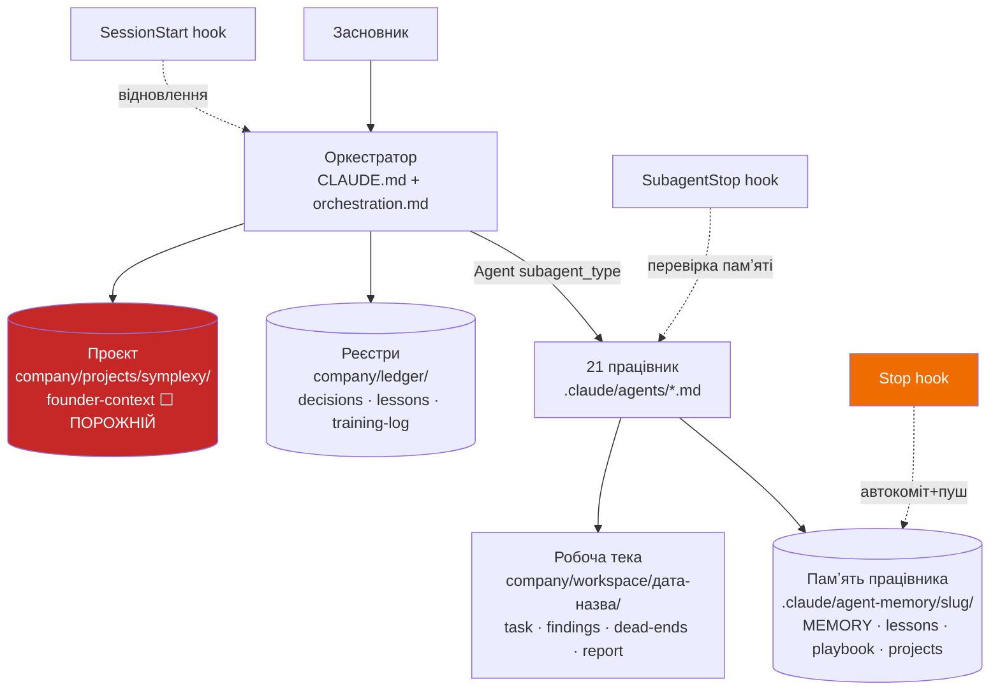
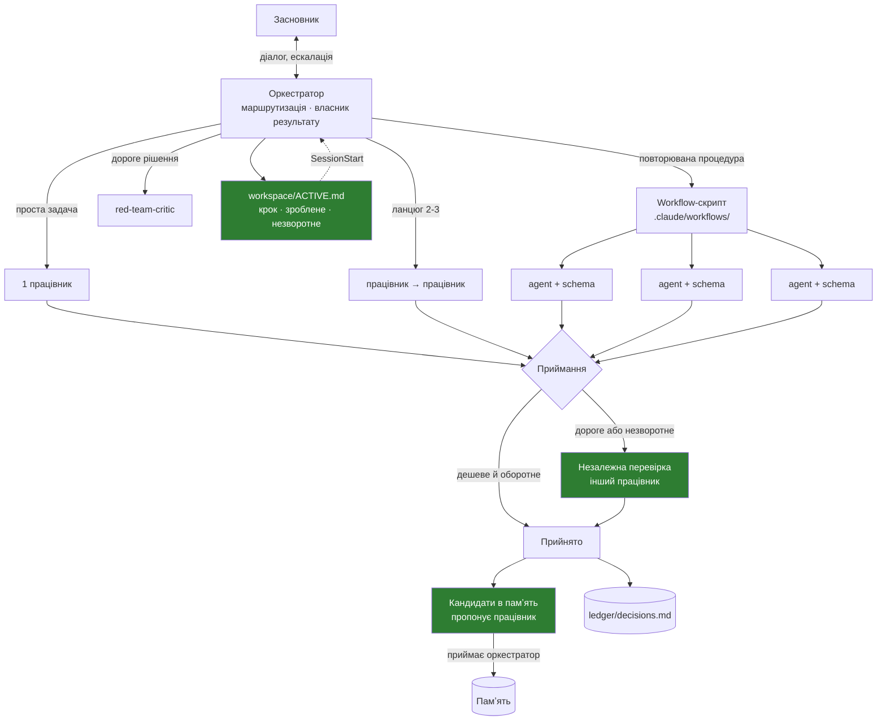

# Аудит архітектури Hermes

**Дата:** 2026-08-01
**Предмет:** документ гіпотез архітектури Hermes (джерело — ChatGPT)
**Метод:** звірка кожної гіпотези з (а) фактичним станом репозиторію, (б) офіційною
документацією Claude Code / Anthropic
**Змін у системі не внесено.** Це аудит, не впровадження.

> **Частина II — `report-part2-sessions.md`** (життєвий цикл сесій, безперервність
> контексту, ієрархія джерел правди). Читати після цієї. Оновлена фінальна рекомендація —
> в кінці частини II.

---

## A. Executive Summary

### Головний висновок

**Не будуйте Hermes так, як описано в документі. Ви його вже здебільшого побудували,
а половина решти існує в Claude Code як нативний механізм.**

Документ — якісно поставлені питання, але його архітектурна частина на ~70% є
повторним виведенням того, що вже:

- реалізовано в цьому репозиторії (21 працівник, памʼять, протоколи, хуки), або
- надано платформою Claude Code безкоштовно (ізоляція контексту, обмеження інструментів,
  ліміти делегації, детермінована оркестрація, персистентна памʼять субагентів).

Цінність документа не в архітектурі. Вона у **пʼяти питаннях, на які у вас справді
немає відповіді** (розділ C).

### Що в гіпотезі правильно

| Теза | Вердикт |
|---|---|
| Не передавати субагенту весь чат — дорого і шумно | **Правильно, і це не опція.** Субагент фізично не бачить історію розмови. Структурована передача — обовʼязкова, не бажана |
| Розділяти типи памʼяті (знання / стан / рішення / процедури / логи) | **Правильно**, і у вас це вже так |
| «Результат субагента — неперевірена пропозиція, доки не підтверджений» | **Найцінніший рядок документа.** У вас це НЕ забезпечено |
| Hermes лишається власником результату, субагент не завершує задачу для користувача | **Правильно** і вже так працює |
| Не давати агенту самому міняти власні фундаментальні правила | **Правильно** |
| Не перечитувати всю історію після рестарту | **Правильно**, у вас є SessionStart-хук |

### Що в гіпотезі неправильно

| Теза | Вердикт |
|---|---|
| Контракт передачі з 17 вхідних + 16 вихідних полів | **Помилка форми.** Субагент повертає **текст**, а не структуру. 16-польовий пакет через повідомлення не повернеться надійно |
| Поля `allowed_tools`, `forbidden_actions`, `budget`, `time_or_turn_limit` у тексті завдання | **Помилка рівня.** Це нативні поля конфігурації (`tools`, `disallowedTools`, `maxTurns`, `permissionMode`). Прохання до моделі ≠ гарантія системи |
| Embeddings і semantic retrieval для памʼяті | **Шкідливо на вашому масштабі.** 147 файлів / ~2 300 рядків. grep детермінований, безкоштовний і не має індексу, що застаріває |
| Confidence score на записі памʼяті | **Фальшива точність.** Це число, яке модель вигадує |
| Versioning, rollback, provenance як окрема підсистема | **Дублює git.** У вас уже є версії, відкат і `git blame` |
| Окрема база під кожен тип памʼяті | **Зайве.** Файли + git. Бази даних тут — це витрати на підтримку без виграшу |
| `task_id`, `parent_task_id`, `created_at`, `updated_at` веде LLM | **Дрейфуватиме.** Або генерує код, або цього немає |

### Чого бракує (справжні прогалини)

1. **Незалежна перевірка результату відсутня.** Працівник сам заявляє, що готово, і сам
   оновлює свою памʼять. Хук перевіряє *що памʼять змінилась*, а не *що вона правдива*.
2. **Механічного забезпечення протоколів немає.** Ескалація, обмеження дій, бюджет —
   усе це текст, який модель може прочитати і не виконати.
3. **Відновлення незавершеної задачі відсутнє.** Якщо ланцюг із чотирьох працівників
   впаде на третьому — ніде не записано, що саме було в польоті.
4. **CLAUDE.md коштує токенів у 21 місці.** Він вантажиться в контекст кожного субагента,
   хоча написаний для оркестратора.
5. **`founder-context.md` порожній.** 104 рядки, майже всюди «невідомо». Це блокує всіх
   21 працівників сильніше за будь-яку архітектурну ваду.

### Рекомендована модель

**Гібрид:** оркестратор-маршрутизатор (як зараз) + детерміновані workflow-скрипти для
повторюваних багатоагентних процедур + механічне забезпечення обмежень через frontmatter
замість прози.

Деталі — розділ E. Мінімальна версія — розділ F.

---

## B. Карта поточної гіпотези проти фактичного стану

### Що вже існує в репозиторії



### Відповідність гіпотези ChatGPT фактичному стану

| Гіпотеза (розділ 3) | Де це вже є | Статус |
|---|---|---|
| Global Constitution | `CLAUDE.md` | ✅ є |
| User Profile | `company/projects/<p>/founder-context.md` | ⬜ **є файл, порожній зміст** |
| Long-Term Memory | `agent-memory/<slug>/lessons.md` + `playbook.md` | ✅ є |
| Project Memory | `company/projects/<p>/` | ✅ є |
| Current State | `company/workspace/<задача>/task.md` | 🟡 є частково, лише під час задачі |
| Task Ledger | — | ❌ **немає** |
| Decision Log | `company/ledger/decisions.md` | ✅ є |
| Skills / Procedures | `.claude/skills/` + `.agents/skills/` | ✅ є |
| Artifacts | `company/workspace/` | ✅ є |
| Raw Logs | `~/.claude/projects/` (транскрипти сесій) | ✅ **є безкоштовно, будувати не треба** |

**8 із 10 сховищ уже існують.** Будувати треба щонайбільше одне (Task Ledger), і в
набагато меншому вигляді, ніж описано.

---

## C. Критичні проблеми

Відсортовано за добутком «імовірність × критичність».

### C1. Протоколи забезпечені прозою, а не механікою

**Проблема.** `escalation.md` забороняє витрачати гроші, публікувати назовні, робити
незворотні дії. `handoff.md` забороняє заходити в чужу зону. Це текст. Працівник має
`Bash`, `WebFetch`, `Write` — технічно він може зробити зовнішній запит або переписати
що завгодно. Єдине, що його стримує — те, що він прочитав інструкцію і вирішив її
виконати.

**Чому виникне.** Модель під тиском задачі («зроби, щоб працювало») систематично
надає перевагу виконанню перед обмеженням. Це не гіпотеза про надійність моделі —
це причина, чому платформа взагалі має поля дозволів.

**Наслідки.** Тихе порушення протоколу, яке ніхто не помітить, бо звіт виглядатиме
нормально.

**Імовірність:** висока (при достатній кількості запусків — неминуче)
**Критичність:** висока (гроші, публікації, незворотні дії)

**Рішення.** Перенести обмеження з прози в конфігурацію. Верифіковані нативні поля:

| Що обмежуємо | Нативне поле | Зараз у репо |
|---|---|---|
| дозволені інструменти | `tools:` | ✅ використовується |
| заборонені інструменти | `disallowedTools:` | ❌ не використовується |
| ліміт кроків / бюджет | `maxTurns:` | ❌ не використовується |
| режим підтверджень | `permissionMode:` | ❌ не використовується |
| попереднє завантаження скілів | `skills:` | ❌ не використовується |
| хуки на конкретного працівника | `hooks:` | ❌ не використовується |
| рівень зусиль (вартість) | `effort:` | ❌ не використовується |

Приклад для `red-team-critic`, який не повинен нічого змінювати:

```yaml
tools: Read, Glob, Grep, WebSearch, WebFetch, Skill
disallowedTools: Write, Edit, Bash
maxTurns: 30
```

Приклад для `fullstack-engineer`, який має право писати, але не робити зовнішні дії
без підтвердження:

```yaml
permissionMode: default
disallowedTools: WebFetch
maxTurns: 60
```

Це важливо не тому, що працівник «зловмисний», а тому що **неможливе краще за
заборонене**.

---

### C2. Працівник сам підтверджує власну роботу

**Проблема.** Це саме те, про що питає документ («як запобігти ситуації, коли агент
формально підтверджує власну роботу») — і у вас відповіді немає.

Ланцюжок зараз: працівник робить → працівник пише звіт → працівник заявляє DoD →
працівник оновлює власну памʼять → `SubagentStop` перевіряє, що **файли памʼяті
змінились**.

Хук перевіряє факт запису, а не його правдивість. Працівник, який записав у `lessons.md`
хибний урок, пройде перевірку так само, як той, хто записав правильний.

**Чому виникне.** Модель оцінює власну роботу з тим самим упередженням, з яким її
виконувала. Вона бачить свій ланцюг міркувань і вважає його переконливим.

**Наслідки.** Найгірший клас помилки в цій системі: **хибний урок, записаний у
довгострокову памʼять**. Він переживе сесію, потрапить у промпт наступного разу і
буде застосований до іншого бізнесу як «ремесло». Одна така помилка отруює 147 файлів.

**Імовірність:** середня-висока
**Критичність:** дуже висока (памʼять комітиться і поширюється між проєктами)

**Рішення (за вартістю, від найдешевшого):**

1. **Розділити «зробив» і «прийняв».** Працівник **пропонує** запис у памʼять у звіті.
   Записує — оркестратор або окремий прохід. Ви вже маєте для цього правильну назву:
   `memory_candidates` у документі ChatGPT — це один із небагатьох його полів, які варто
   взяти дослівно.
2. **Для дорогої/незворотної роботи — обовʼязковий другий агент.** Не «за бажанням
   оркестратора», а як умова прийому. `red-team-critic` уже існує і має правильні
   налаштування для цього.
3. **Регулярна ревізія памʼяті.** `monthly-training.md` уже існує — посилити перевіркою
   джерела кожного уроку.

Дорогі механізми з документа (confidence score, TTL, conflict detection) **не потрібні**:
дешевша й надійніша заміна — щоб урок узагалі не потрапляв у памʼять без другої пари очей.

---

### C3. CLAUDE.md вантажиться в контекст кожного з 21 працівника

**Проблема (перевірений факт).** Початковий контекст субагента містить **усю ієрархію
CLAUDE.md**, включно з проєктним. Ваш `CLAUDE.md` — це ~200 рядків, написаних для
оркестратора: «Моя роль», «я не виконую профільну роботу сам», таблиці маршрутизації,
протокол робочої теки, ліміти паралельних запусків.

Працівник отримує все це і не потребує нічого з цього. Гірше — він читає інструкції,
адресовані іншій ролі.

**Наслідки.** Постійний токен-податок на кожен запуск ×21 працівник × кожна задача.
Плюс розмиття уваги: правила оркестрації конкурують за увагу з фактичним завданням.

**Імовірність:** 100% (це відбувається зараз при кожному запуску)
**Критичність:** середня (гроші й якість, не безпека)

**Рішення.** Розділити `CLAUDE.md` на дві частини:
- **спільне для всіх** (правда понад усе, розділення проєктів, памʼять, мова) — лишається;
- **тільки для оркестратора** (маршрутизація, ліміти запусків, протокол теки, коли кликати
  критика) — виноситься в `company/protocols/orchestration.md`, який оркестратор читає
  сам, а працівники — ні.

Це не косметика. Це зменшує вхідний контекст кожного запуску і прибирає рольовий шум.

---

### C4. Немає відновлення задачі, що була в польоті

**Проблема.** `SessionStart`-хук показує стан **компанії** (скільки працівників, який
проєкт, чи заповнений контекст). Він не показує стан **роботи**: що виконувалось, на
якому кроці впало, що вже зроблено, що ні.

Контейнер ефемерний. Ланцюг із чотирьох працівників, який урвався на третьому, після
рестарту не відновлюється — він починається спочатку або, гірше, вважається завершеним.

**Чому виникне.** Обрив сесії, вичерпаний контекст, помилка API, закритий ноутбук.

**Наслідки.** Повторне виконання вже зробленого (витрати) або тихо втрачений крок
(незавершена робота, яку вважають готовою).

**Імовірність:** висока
**Критичність:** середня

**Рішення — мінімальний Task Ledger, а не той, що в документі.** Не 14 полів на задачу.
Один файл `company/workspace/ACTIVE.md`, який оркестратор переписує при зміні кроку:

```
Задача: <назва>   Тека: company/workspace/<...>
Крок 2/4: fullstack-engineer — виконується
Готово: 1 (principal-architect → arch.md)
Далі: qa-lead, потім devops-sre
Незворотне зроблене: немає
```

`SessionStart`-хук читає цей файл і кладе в брифінг. Пʼять рядків коду, закриває
проблему. Рядок «незворотне зроблене» — критичний: він відповідає на питання документа
«як уникати повторного виконання небезпечних дій».

---

### C5. Stop-хук автоматично пушить у `main` без рев'ю

**Проблема.** `memory-guard.sh` при кожній зупинці сесії комітить `.claude/agent-memory`
і `company`, пушить у поточну гілку і **дзеркалить у `main` та гілку за замовчуванням**.

Це свідоме рішення (контейнер ефемерний, памʼять інакше зникне), і воно захищене:
пуш не `force`, тому при розходженні просто не пройде; при підозрі на секрет коміт
пропускається.

Але наслідок треба назвати прямо: **у `main` автоматично потрапляє неперевірений вміст
памʼяті**. Якщо спрацював C2 і в памʼять записано хибний урок — він опиниться в `main`
без жодного людського погляду.

**Імовірність:** 100% (працює зараз)
**Критичність:** середня (наслідок C2, не самостійна вада)

**Рішення.** Не вимикати — механізм правильний, альтернатива (втрата памʼяті) гірша.
Але: сканер секретів зараз ловить лише формати ключів. Варто додати перевірку, що в
памʼять не потрапили **факти проєкту в файлі ремесла** — це друга за тяжкістю помилка
цієї системи після хибного уроку.

---

### C6. `founder-context.md` порожній

**Проблема.** 104 рядки, в яких майже все — «невідомо». Продукт, стадія, ціна,
користувачі, конкуренти — нічого.

**Наслідки.** Кожен із 21 працівника або перепитує (втрачений запуск), або працює на
загальних припущеннях і видає правдоподібний текст ні про що. Жодна архітектурна зміна
цього не виправляє.

**Імовірність:** 100%
**Критичність:** найвища з практичного погляду

**Рішення.** Заповнити. Це година розмови, і вона дає більше, ніж усі інші пункти
цього аудиту разом.

---

## D. Порівняння альтернатив

### 1. Один головний агент + субагенти (поточна модель)

Оркестратор вирішує покроково, кого запустити. Результати повертаються в його контекст.

### 2. Ієрархічна компанія агентів (модель документа)

Працівники самі делегують глибше. **Технічно можливо:** вкладені субагенти підтримуються,
глибина керується `CLAUDE_CODE_MAX_SUBAGENT_SPAWN_DEPTH`. Зараз у вас вимкнено де-факто —
`Agent` відсутній у списках `tools`.

### 3. Workflow / state machine з LLM-вузлами

**Це існує нативно.** Dynamic workflows — JavaScript-скрипт, який оркеструє субагентів;
`agent()` запускає одного, `pipeline()` — по одному на елемент списку. Проміжні результати
живуть у змінних скрипта, **а не в контексті оркестратора**. Скрипт зберігається в
`.claude/workflows/` і стає командою `/<name>`.

Критично: `agent()` приймає `schema:` — тобто **структурований вихід**, а не текст.
Це саме те, чого документ хоче від «вихідного пакета», і чого звичайний субагент дати
не може.

Ліміти: до 16 паралельних агентів, 1 000 на запуск, відновлення в межах тієї ж сесії.

### 4. Гібрид (рекомендовано)

Оркестратор для маршрутизації й діалогу + workflow для повторюваних багатоагентних
процедур (аудит, місячне навчання, перевірка перед релізом).

### Порівняльна таблиця

| Критерій | 1. Оркестратор | 2. Ієрархія | 3. Workflow | 4. Гібрид |
|---|---|---|---|---|
| Надійність | середня | **низька** | висока | висока |
| Складність | низька | висока | середня | середня |
| Вартість токенів | середня | **дуже висока** | висока на запуск | керована |
| Масштабованість | до ~5 паралельно | теоретично висока | **до 1000 агентів** | висока |
| Керованість | висока | **низька** | висока | висока |
| Якість памʼяті | висока | середня | висока | висока |
| Відновлення | слабке | **дуже слабке** | у межах сесії | середнє |
| Швидкість | середня | низька | висока | висока |
| Прозорість | висока | **низька** | висока (скрипт читається) | висока |
| Безпека | середня | **низька** | висока | висока |
| Повторюваність | **низька** | низька | **висока** | висока |

### Чому варіант 2 (модель документа) відкидається

1. **Вузьке місце не там, де його шукає документ.** Питання «чи стане Hermes вузьким
   місцем» має відповідь **так — за контекстом, а не за пропускною здатністю**. Кожен
   звіт працівника лягає в контекст оркестратора. Ієрархія це **погіршує**: додає рівні,
   кожен зі своїм переказом.

2. **Спотворення на кожній передачі.** Документ сам ставить це питання
   («як уникнути спотворення висновків під час багатьох передач») — і пропонує
   архітектуру, що максимізує кількість передач. Кожен рівень — це переказ переказу.

3. **Втрата власності над результатом.** Документ вимагає, щоб Hermes лишався власником.
   Ієрархія цьому суперечить: повертається лише зведення верхнього субагента, проміжне
   до оркестратора не доходить взагалі.

Ієрархія виправдана лише у вузькому випадку: субагент, який віялом запускає однотипні
перевірки (рецензент → верифікатор на кожну знахідку). Для роботи компанії — ні.

### Чому варіант 3 не замінює 1 повністю

Workflow не приймає введення користувача під час виконання. Для «підпишіть тут» посеред
ланцюга він не годиться — потрібен окремий workflow на кожну стадію. Тому діалог і
ескалація лишаються за оркестратором.

---

## E. Рекомендована цільова архітектура



Зелене — те, чого зараз немає.

### Компоненти

| Компонент | Роль | Де живе | Власник |
|---|---|---|---|
| Оркестратор | маршрутизація, діалог, приймання, власність результату | `CLAUDE.md` (скорочений) | засновник |
| Протокол оркестрації | таблиці маршрутизації, ліміти, план до запуску | `company/protocols/orchestration.md` | оркестратор |
| Працівники | профільне виконання | `.claude/agents/*.md` | оркестратор |
| Обмеження працівників | **frontmatter, не проза** | те саме, поля `tools`/`disallowedTools`/`maxTurns` | оркестратор |
| Памʼять-ремесло | уроки, процедури (спільні між бізнесами) | `.claude/agent-memory/<slug>/` | працівник пропонує, оркестратор приймає |
| Памʼять-проєкт | факти бізнесу (ізольовані) | `.claude/agent-memory/<slug>/projects/<p>/` + `company/projects/<p>/` | те саме |
| Реєстр рішень | незворотні й дорогі рішення | `company/ledger/decisions.md` | оркестратор |
| Активний стан | що виконується, що вже незворотне | `company/workspace/ACTIVE.md` | оркестратор |
| Повторювані процедури | аудит, навчання, передреліз | `.claude/workflows/` | оркестратор |
| Сирі логи | транскрипти сесій | `~/.claude/projects/` (нативно) | платформа |

### Комунікація

- **Працівник → оркестратор:** текстове зведення + **файл** у робочій теці. Великі
  артефакти не переказуються, а лишаються у файлі — оркестратор читає шлях, а не вміст.
- **Працівник → працівник:** тільки через оркестратора (розділ «Передав далі» в
  `handoff.md` — форма вже правильна).
- **Уточнення без перезапуску:** `SendMessage` дозволяє продовжити вже завершеного
  субагента з повною історією. Це дешевше, ніж перезапускати з нуля, і закриває питання
  документа «як перевірити, що субагент правильно зрозумів задачу».
- **Структурований вихід:** там, де він справді потрібен — через workflow і `schema:`.
  У звичайному запуску вимагати 16-польовий пакет у тексті марно.

---

## F. Спрощена перша версія

**Це не «побудувати Hermes». Це шість змін до того, що вже працює.**

| # | Зміна | Обсяг | Закриває |
|---|---|---|---|
| 1 | Заповнити `founder-context.md` | година розмови, без коду | C6 |
| 2 | Перенести обмеження в frontmatter (`disallowedTools`, `maxTurns`) | 21 файл, механічна правка | C1 |
| 3 | Розділити `CLAUDE.md`: спільне лишити, оркестраторське винести | 2 файли | C3 |
| 4 | Памʼять: працівник **пропонує**, оркестратор **записує** | правка `definition-of-done.md` + `handoff.md` | C2 |
| 5 | `workspace/ACTIVE.md` + читання в `SessionStart`-хуку | 1 файл + ~5 рядків bash | C4 |
| 6 | Сканер памʼяті: додати перевірку на факти проєкту у файлах ремесла | ~10 рядків у `memory-guard.sh` | C5 |

Усе. Нічого з цього не є новою підсистемою. Нових сховищ — нуль. Нових агентів — нуль.

---

## G. План еволюції

**Phase 0 — аудит середовища.** ✅ Виконано (цей документ).

**Phase 1 — контекст бізнесу.**
Мета: працівники знають, на що працюють.
Файли: `company/projects/symplexy/founder-context.md`.
Готово: заповнені розділи 1–2, решта явно позначена «невідомо».
Ризик: заповнити здогадами. Правило вже записане в шапці файлу — дотримати.

**Phase 2 — механічні обмеження.**
Мета: протоколи не залежать від доброї волі моделі.
Файли: `.claude/agents/*.md` (frontmatter), `.claude/settings.json`.
Готово: у кожного працівника явні `disallowedTools` і `maxTurns`; `red-team-critic` і
`Explore`-подібні ролі — тільки читання.
Тест: запустити працівника із завданням, що вимагає забороненого інструменту — має
відмовити механічно, а не за власним рішенням.
Ризик: занадто вузько обмежити і зламати робочі сценарії. Мітигація: спершу один
працівник, потім решта.

**Phase 3 — контекстна гігієна.**
Мета: прибрати оркестраторський шум із контексту працівників.
Файли: `CLAUDE.md`, `company/protocols/orchestration.md`.
Готово: `CLAUDE.md` < 80 рядків, усе рольове — в протоколі.
Тест: запустити працівника, спитати, які в нього інструкції — не має цитувати правила
маршрутизації.

**Phase 4 — приймання і памʼять.**
Мета: жоден урок не потрапляє в памʼять без другої пари очей.
Файли: `definition-of-done.md`, `handoff.md`, `worker-memory-check.sh`.
Готово: у звіті працівника є розділ «пропоную в памʼять»; запис робить оркестратор.
Тест: працівник завершує роботу — памʼять не змінилась; після приймання — змінилась.
Умова переходу далі: пройшов один повний цикл із реальною задачею.

**Phase 5 — відновлення.**
Мета: обірвана сесія не втрачає і не повторює роботу.
Файли: `company/workspace/ACTIVE.md`, `.claude/hooks/session-brief.sh`.
Готово: після рестарту брифінг показує крок і перелік уже зробленого незворотного.
Тест: обірвати сесію посеред ланцюга, стартувати нову — брифінг має назвати крок.

**Phase 6 — повторювані процедури (лише за потреби).**
Мета: `/audit` і `/team-training` виконуються однаково щоразу.
Файли: `.claude/workflows/`.
Умова входу: **процедуру прогнали вручну щонайменше двічі** і вона стабільна.
Кодифікувати нестабільний процес — марна робота.

---

## H. Що відкинути

### Не будувати взагалі

| Що | Чому |
|---|---|
| Embeddings / semantic retrieval над памʼяттю | 147 файлів. grep детермінований, безкоштовний, без індексу, що застаріває. Вектори тут — витрати без виграшу |
| Окрема БД під кожен тип памʼяті | Файли + git дають версії, історію, дифи, відкат. БД додає стан, який треба супроводжувати |
| Confidence score на записах | Число, яке модель вигадує. Створює хибне відчуття вимірності |
| Versioning / rollback як підсистема | Це git. Уже є |
| Provenance як окреме поле | `git log` і `git blame`. Достатньо посилання на задачу в тексті уроку |
| Сховище Raw Logs | Транскрипти вже пишуться в `~/.claude/projects/` |
| Повний контракт 17+16 полів | Субагент повертає текст. Великий пакет або не повернеться, або буде вигаданий |
| Ієрархічне делегування (працівник → працівник) | Множить спотворення і вартість, ламає власність результату |

### Відкласти

| Що | До якого моменту |
|---|---|
| Dynamic workflows | Поки процедура не прогнана вручну двічі й не стабільна |
| Agent teams (пряме спілкування агентів) | Експериментальні, вимкнені за замовчуванням, дорожчі за токенами, не відновлюються після рестарту. Для вашої задачі перевага незрозуміла |
| Повний Task Ledger із 14 полями | Мінімальний `ACTIVE.md` закриває 90% користі |
| Kill switch | Механізм існує (Esc, `x` у панелі, ліміти). Окремої надбудови не треба |

### Припущення, які треба перевірити окремо

1. **Що саме таке Hermes стосовно наявної компанії?** Документ описує його як
   центральний агент. У вас цю роль уже виконує оркестратор. Якщо Hermes — це нова
   назва того самого, більшість документа зайва. Якщо це **окремий продукт для клієнтів** —
   це зовсім інша задача, і аудит треба переробити під неї. **Це головна прогалина
   цього аудиту.**
2. Версія Claude Code в цьому середовищі. Частина полів має мінімальні версії
   (`SendMessage` — v2.1.206, workflows — v2.1.154, налаштовувана глибина вкладеності —
   v2.1.217). Перед впровадженням Phase 2 звірити.
3. Чи справді потрібні всі 21 працівник для одного проєкту на стадії порожнього
   контексту. Не перевірялось у цьому аудиті.

---

## I. Фінальна рекомендація

**Будувати:** гібрид — оркестратор-маршрутизатор (той, що є) + механічні обмеження в
конфігурації + детерміновані workflow пізніше й лише для перевірених процедур.

**Чому саме його.** Модель документа (ієрархічна компанія агентів) погіршує рівно те,
заради чого створюється: вона множить передачі, а отже спотворення; збільшує вартість;
і забирає в Hermes власність над результатом, яку сам документ називає обовʼязковою.
Поточна модель уже правильна. Її проблема не в структурі, а в тому, що **її правила
живуть у прозі, а не в механіці**.

**Перші три кроки:**

1. Заповнити `founder-context.md`. Без цього решта — оптимізація порожнечі.
2. Перенести обмеження працівників у frontmatter (`disallowedTools`, `maxTurns`).
3. Розділити памʼять на «працівник пропонує / оркестратор записує».

**Свідомо не робити зараз:** вектори, окремі БД, ієрархічне делегування, agent teams,
повний Task Ledger, confidence score, окрему підсистему версіювання.

**Рішення, які буде важко змінити пізніше:**

- **Структура памʼяті.** 147 файлів уже написані. Переїзд коштуватиме дорого, і кожна
  міграція — шанс втратити або спотворити урок. Поточна структура (ремесло в корені,
  факти в `projects/`) правильна — **не чіпати**.
- **Розділення ремесла й фактів проєкту.** Якщо змішати зараз, розділити потім буде
  практично неможливо: доведеться вручну переглядати кожен запис. Це найдорожча
  потенційна помилка в системі.
- **Автокоміт памʼяті в git.** Виглядає як деталь, але це єдине, що робить памʼять
  живою в ефемерному контейнері. Вимкнення = тиха втрата всього накопиченого.
- **Slug працівників.** Зміна ламає всі посилання в памʼяті, реєстрах і протоколах.

---

## Джерела

Перевірені твердження про Claude Code спираються на офіційну документацію:

- [Create custom subagents](https://code.claude.com/docs/en/sub-agents) — поля frontmatter,
  ізоляція контексту, що вантажиться на старті, вкладеність, ліміти, персистентна памʼять
- [Orchestrate teams of Claude Code sessions](https://code.claude.com/docs/en/agent-teams) —
  agent teams, пряме спілкування агентів, спільний список задач, обмеження
- [Orchestrate subagents at scale with dynamic workflows](https://code.claude.com/docs/en/workflows) —
  workflow-скрипти, `agent()`, `pipeline()`, `schema:`, ліміти виконання

Твердження про фактичний стан репозиторію перевірені читанням файлів
(`.claude/agents/`, `.claude/hooks/`, `.claude/settings.json`, `company/`) станом на
2026-08-01, гілка `claude/agent-hypothesis-audit-plrzr9`.

**Не перевірено:** версія Claude Code в цьому середовищі; чи є Hermes новою назвою
оркестратора, чи окремим продуктом.
